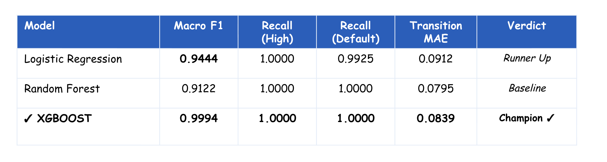

# BK Sentinel

**A three-layer dynamic credit risk transition system for Bank of Kigali (BK)**

BK Sentinel predicts which loan accounts are heading toward default _before_ it happens, using machine learning, empirical Markov chain modeling, and absorbing-state mathematics — combined into a single interactive dashboard for credit analysts.

|                 |                                                                                                                                   |
| --------------- | --------------------------------------------------------------------------------------------------------------------------------- |
| **Author**      | Denyse Mutoni Uwingeneye — BSc. Software Engineering, African Leadership University                                               |
| **Supervisor**  | Emmanuel Adjei                                                                                                                    |
| **Institution** | African Leadership University (ALU)                                                                                               |
| **Live app**    | Backend: `[backend](https://bk-sentinel.onrender.com)` · Frontend: `[Frontend](https://vercel.com/dmutonis-projects/bk-sentinel)` |
| **Demo video**  | `[Video](https://vimeo.com/1206877116)`                                                                                           |

---

## Table of Contents

- [BK Sentinel](#bk-sentinel)
  - [Table of Contents](#table-of-contents)
  - [1. Overview](#1-overview)
  - [2. Glossary of Abbreviations](#2-glossary-of-abbreviations)
  - [3. How the System Works — The Three Layers](#3-how-the-system-works--the-three-layers)
    - [Layer 1 — ML Classification \& Explainability](#layer-1--ml-classification--explainability)
    - [Layer 2 — Portfolio-Level Markov Chain](#layer-2--portfolio-level-markov-chain)
    - [Layer 3 — Absorbing Markov Chain / Long-Run Default Analysis](#layer-3--absorbing-markov-chain--long-run-default-analysis)
  - [4. Key Findings](#4-key-findings)
  - [5. Tech Stack](#5-tech-stack)
  - [6. Project Structure](#6-project-structure)
  - [7. Installation \& Running Locally](#7-installation--running-locally)
    - [Prerequisites](#prerequisites)
    - [Step 1 — Clone the repository](#step-1--clone-the-repository)
    - [Step 2 — Run the backend](#step-2--run-the-backend)
    - [Step 3 — Run the frontend (in a second terminal)](#step-3--run-the-frontend-in-a-second-terminal)
    - [Step 4 — Log in](#step-4--log-in)
  - [8. Re-running the ML Notebooks](#8-re-running-the-ml-notebooks)
  - [9. Testing \& Validation](#9-testing--validation)
  - [10. Known Limitations](#10-known-limitations)
  - [11. Recommendations \& Future Work](#11-recommendations--future-work)
  - [12. Deployment](#12-deployment)
  - [13. Data Privacy \& Compliance](#13-data-privacy--compliance)
  - [14. Acknowledgements \& References](#14-acknowledgements--references)

---

## 1. Overview

Bank of Kigali, like most commercial banks, classifies every loan account into a risk category — Standard, Watchlist, Sub-Standard, Doubtful, or Loss — based on how many days a customer is behind on payments (BNR's prudential classification framework). That system is accurate, but it is entirely **backward-looking**: it tells you where an account is _today_, not where it is _heading_.

BK Sentinel closes that gap. Using a 16-month longitudinal panel of BK loan records (Oct 2024 – Jan 2026, ~67,900 account-months, four customer segments), it does three things:

1. **Predicts** each account's risk state next month using supervised machine learning, and explains _why_ using feature-contribution analysis.
2. **Models** how the entire portfolio migrates between risk states month to month, using an empirical Markov chain transition matrix, with multi-step forecasts computed by raising that matrix to successive powers.
3. **Computes** long-run outcomes using absorbing Markov chain theory — for any account currently in Medium or High risk, what's the probability it eventually reaches Default, and how many months will that take?

The result is a decision-support dashboard, not an automated approval/rejection system — it exists to give credit analysts an early, explainable warning that the bank's current static classification cannot provide.

## 2. Glossary of Abbreviations

| Term                          | Meaning                                                                                                                                                                                                                                                                                                 |
| ----------------------------- | ------------------------------------------------------------------------------------------------------------------------------------------------------------------------------------------------------------------------------------------------------------------------------------------------------- |
| **BK**                        | Bank of Kigali                                                                                                                                                                                                                                                                                          |
| **ALU**                       | African Leadership University — the institution this capstone was completed at                                                                                                                                                                                                                          |
| **BSc.**                      | Bachelor of Science                                                                                                                                                                                                                                                                                     |
| **BNR**                       | National Bank of Rwanda (Banque Nationale du Rwanda) — the banking regulator whose prudential rules define the risk categories used here                                                                                                                                                                |
| **DPD**                       | Days Past Due — the number of days a loan payment is overdue; the primary driver of BNR risk classification                                                                                                                                                                                             |
| **NPL**                       | Non-Performing Loan                                                                                                                                                                                                                                                                                     |
| **CRB**                       | Credit Reference Bureau — third-party source of a customer's total credit exposure across lenders                                                                                                                                                                                                       |
| **IMF**                       | International Monetary Fund — cited for East African NPL benchmarks                                                                                                                                                                                                                                     |
| **ML**                        | Machine Learning                                                                                                                                                                                                                                                                                        |
| **KPI**                       | Key Performance Indicator — the summary metric cards shown at the top of each dashboard page                                                                                                                                                                                                            |
| **REST**                      | Representational State Transfer — the architectural style used by the FastAPI backend's HTTP endpoints                                                                                                                                                                                                  |
| **F1 / Macro F1**             | A classification accuracy metric balancing precision and recall; "macro" means it's averaged equally across all four risk classes regardless of how common each one is                                                                                                                                  |
| **SHAP**                      | SHapley Additive exPlanations — a method for explaining _why_ a model made a specific prediction, by attributing the prediction to individual input features                                                                                                                                            |
| **SMOTE**                     | Synthetic Minority Over-sampling Technique — generates synthetic examples of rare classes (e.g. High/Default accounts) so the model doesn't just learn to predict "Low risk" for everyone                                                                                                               |
| **LCY**                       | Local Currency (Rwandan Francs, RWF, in this dataset)                                                                                                                                                                                                                                                   |
| **RWF**                       | Rwandan Franc                                                                                                                                                                                                                                                                                           |
| **ISIC**                      | International Standard Industrial Classification — the coding system used for the customer's industry sector                                                                                                                                                                                            |
| **API**                       | Application Programming Interface                                                                                                                                                                                                                                                                       |
| **CORS**                      | Cross-Origin Resource Sharing — the browser security mechanism that governs whether the frontend (on one domain) is allowed to call the backend (on another domain)                                                                                                                                     |
| **UML**                       | Unified Modeling Language                                                                                                                                                                                                                                                                               |
| **ERD**                       | Entity Relationship Diagram                                                                                                                                                                                                                                                                             |
| **JSON / CSV**                | Data file formats used for configuration and the panel dataset respectively                                                                                                                                                                                                                             |
| **N, Q, R, B (Layer 3 math)** | `Q` = transition probabilities between non-absorbing ("transient") states; `R` = transition probabilities from transient states into Default; `N = (I − Q)⁻¹` = the _fundamental matrix_, giving expected months spent in each state before absorption; `B = N × R` = the absorption probability matrix |

## 3. How the System Works — The Three Layers

### Layer 1 — ML Classification & Explainability

Three classifiers were trained and compared on the verified panel data: **Logistic Regression** (simple, interpretable baseline), **Random Forest**, and **XGBoost**. Class imbalance (most accounts are Low-risk) is addressed with SMOTE. Models are compared on macro F1 score and per-class recall, with extra weight on catching High and Default accounts, since a missed warning is far costlier than a false alarm.

> **Model selection note:** Random Forest underperformed _even the Logistic Regression baseline_ on this dataset (lower macro F1 and worse per-class recall balance), so it is retained here as a secondary comparison point rather than a leading candidate. **XGBoost is the production model.** See the table below — final numbers pending the full notebook re-run (see [§8](#8-re-running-the-ml-notebooks)).



Once a prediction is made, per-account feature contributions are computed using XGBoost's own native Tree SHAP implementation (`Booster.predict(..., pred_contribs=True)`) — mathematically identical to the third-party `shap` library's output, but without a dependency that was found to crash (segfault) on some machines during this project.

### Layer 2 — Portfolio-Level Markov Chain

An empirical monthly transition matrix `P` is built directly from the panel data by counting how many accounts moved between each pair of risk states across 15 consecutive monthly transitions. Multi-step forecasts (e.g. "where will this portfolio be in 3 months?") are computed mathematically by raising `P` to successive powers (`P²`, `P³`, …, `Pⁿ`).

### Layer 3 — Absorbing Markov Chain / Long-Run Default Analysis

Default is treated as an **absorbing state** (once entered, essentially never left — 99.7% empirical monthly self-retention; the small residual "leak" comes from just 17 recorded exits out of 6,177 Default-month observations, too sparse to model as a meaningful recovery path). The transition matrix is rearranged into canonical form (`Q` = transient-to-transient, `R` = transient-to-Default), and the fundamental matrix `N = (I − Q)⁻¹` is computed via matrix inversion (`numpy.linalg.inv`) to get the expected number of months an account spends in each state before eventually reaching Default, and the absorption probability matrix `B = N × R`.

## 4. Key Findings

These are computed directly from the verified transition data and are independent of which Layer 1 classifier is deployed:

- **High → Default (1 month): 22.2%** — nearly 1 in 4 High-risk accounts default within a single month.
- **Medium → Low (1 month): 18.1%** — roughly 1 in 5 Watchlist-stage accounts recover fully within a month, showing early intervention has real payoff.
- **Default persistence: 99.7%** monthly — Default is effectively a one-way door.
- **Expected months to Default (Layer 3):** Low ≈ 61 months, Medium ≈ 48 months, High ≈ 17.5 months.
- All three transient states show ~100% long-run probability of eventual absorption into Default if no intervention occurs — underscoring why early-stage intervention (at Low/Medium) matters far more than late-stage intervention.

## 5. Tech Stack

| Layer                              | Tools                                                                                |
| ---------------------------------- | ------------------------------------------------------------------------------------ |
| Data processing                    | Python, pandas, numpy                                                                |
| ML — Layer 1                       | scikit-learn (Logistic Regression, Random Forest), XGBoost, imbalanced-learn (SMOTE) |
| Explainability                     | XGBoost native Tree SHAP (`pred_contribs`)                                           |
| Markov / absorption — Layers 2 & 3 | numpy (`linalg.inv`, `matrix_power`)                                                 |
| Backend API                        | FastAPI, uvicorn                                                                     |
| Frontend                           | React 18, Vite, React Router                                                         |
| Deployment                         | Render (backend), Vercel (frontend)                                                  |

**Note on deviation from the original proposal:** the proposal specified a Streamlit dashboard backed by PostgreSQL. During implementation this was upgraded to a React single-page application with a dedicated FastAPI REST backend, for a more interactive, production-like analyst experience with proper routing, authentication, and pagination. The verified panel data is served directly from CSV/pickle artifacts rather than a database, since the dataset is static for this academic prototype — a database was judged unnecessary overhead for the current scope.

## 6. Project Structure

```
BK_sentinel/
├── model-training/              # Notebooks, data, and trained model artifacts
│   ├── bk_sentinel_verified.csv       # Full 16-month verified panel dataset
│   ├── bk_best_model.pkl              # Trained champion model (XGBoost)
│   ├── bk_label_encoders.pkl          # Encoders for segment / loan_type
│   ├── bk_feature_cols.json           # Ordered feature list used by the model
│   ├── bk_transition_matrix.csv       # Empirical Layer 2 transition matrix
│   ├── bk_transition_counts.csv       # Raw transition counts behind the matrix
│   ├── bk_time_to_absorption.csv      # Layer 3 expected months to Default
│   ├── bk_fundamental_matrix.csv      # Layer 3 fundamental matrix N
│   ├── bk_absorption_probabilities.csv
│   ├── 01_data_pipeline.ipynb
│   ├── 02_layer1_classification.ipynb
│   ├── 03_layer2_markov.ipynb
│   └── 04_layer3_absorption.ipynb
├── backend/                     # FastAPI backend
│   ├── main.py
│   ├── config.py
│   ├── requirements.txt
│   ├── runtime.txt                    # Pins Python version for deployment
│   ├── database/loader.py             # Cached data & model loading
│   ├── middleware/auth.py             # Token auth + signup
│   ├── schemas/models.py
│   ├── services/{markov,predictor,shap_service}.py
│   └── routers/{auth,overview,transition,watchlist,account,absorption}.py
├── frontend/                    # React (Vite) frontend
│   ├── package.json
│   ├── vite.config.js                 # Dev proxy to backend
│   ├── vercel.json                    # Prod proxy to backend (Render)
│   └── src/
│       ├── api/client.js              # All API calls
│       ├── components/
│       └── pages/{Login,Overview,AccountLookup,Watchlist,Portfolio}.jsx
└── Procfile                     # Deployment start command
```

## 7. Installation & Running Locally

### Prerequisites

- Python 3.11 (matches `backend/runtime.txt`)
- Node.js 18+ and npm
- Git

### Step 1 — Clone the repository

```bash
git clone https://github.com/dmutoni/BK_sentinel.git
cd BK_sentinel
```

### Step 2 — Run the backend

```bash
cd backend
python3 -m venv .venv
source .venv/bin/activate          # Windows: .venv\Scripts\activate
pip install -r requirements.txt
uvicorn main:app --reload --port 8000
```

Watch the terminal for `All data loaded. Server ready.` before continuing. API docs are available at `http://localhost:8000/docs`.

### Step 3 — Run the frontend (in a second terminal)

```bash
cd frontend
npm install
npm run dev
```

Open `http://localhost:3000` in your browser. The Vite dev server proxies `/api` calls to the backend on port 8000 — if you run the backend on a different port, update the `target` in `frontend/vite.config.js` to match.

### Step 4 — Log in

Demo accounts:
| Username | Password | Role |
|---|---|---|
| `denyse` | `alu2026` | Researcher |

New accounts can also be created directly from the login screen ("Sign up").

## 8. Re-running the ML Notebooks

Notebooks live in `model-training/` and must be run **in order**, top to bottom, in Jupyter:

1. `01_data_pipeline.ipynb` — loads, verifies, and anonymizes the raw panel data
2. `02_layer1_classification.ipynb` — feature engineering, SMOTE, trains and compares Logistic Regression / Random Forest / XGBoost, saves the champion model to `bk_best_model.pkl`
3. `03_layer2_markov.ipynb` — builds the empirical transition matrix
4. `04_layer3_absorption.ipynb` — computes the fundamental matrix and absorption probabilities

**Important:** if you change the feature list or retrain in Notebook 02, make sure you run the final "Save model artifacts" cell — otherwise the backend keeps using whichever model was last saved to disk, which can silently drift out of sync with what the notebook displays. This project hit exactly that issue during development, which is why the model comparison table in [§3](#3-how-the-system-works--the-three-layers) is being re-verified against a fresh, full top-to-bottom run.

```bash
cd model-training
pip install jupyter pandas numpy scikit-learn xgboost imbalanced-learn scipy --break-system-packages
jupyter notebook
```

## 9. Testing & Validation

**Functional testing** was performed across every page (Overview, Account Lookup, Risk Watchlist, Portfolio Analysis, Login/Signup) using the live dataset, covering all 11 Watchlist filter types and multiple forecast horizons (1, 2, 3, and 6 months).

**Testing with different data values:**

- Account Lookup tested against accounts in every risk state (Low, Medium, High, Default), including edge cases like accounts with 0 days in arrears and accounts oscillating in Medium for 16 consecutive months.
- Search input tested with partial IDs, full IDs, and malformed input containing special regex characters (originally caused a crash — fixed to use literal substring matching).
- Watchlist tested across every month in the 16-month panel and all four customer segments.

**Testing across different software/hardware environments:**

- Backend run locally on macOS under Python 3.9 (initial setup) and Python 3.11 (post-migration for deployment compatibility).
- Deployed and verified on Render (Linux container, Python 3.11) for the backend and Vercel (edge network) for the frontend — a genuinely different OS/runtime combination from local development, which surfaced real bugs (see below) that local testing alone had not caught.
- Cross-browser manual verification in Chrome.

**Bugs found and fixed during testing** (kept here for transparency/reproducibility):

- A regex-based account search crashed on inputs containing unescaped special characters — fixed by switching to literal substring matching.
- The `shap` library's `TreeExplainer` caused a hard segmentation fault against the production XGBoost model on macOS — root-caused via isolated `import shap` testing, and resolved by replacing it with XGBoost's own native Tree SHAP computation, removing the dependency entirely.
- A CORS/port mismatch between the frontend proxy and backend during local dev, and a Python-version-driven `pandas` build failure on Render (fixed via `runtime.txt` pinning Python 3.11).

`docs/screenshots/` _(add your test screenshots here before submission — one per page, plus at least one showing an edge case and one showing the deployed version running successfully)._

## 10. Known Limitations

- **Dataset scope:** results reflect a single institution (Bank of Kigali) over a specific 16-month window (Oct 2024 – Jan 2026) and may not generalize to other periods, institutions, or macroeconomic conditions outside that window.
- **Sparse Default-exit data:** only 17 of 6,177 Default-state observations ever left Default, which is why Default is modeled as a strict absorbing state rather than allowing partial recovery — the real recovery rate is too small a sample to estimate reliably.
- **Feature engineering risk:** an expanded, trajectory-based feature set (`months_in_state`, `projected_dpd_next`, and similar features) was explored in Notebook 02 and produced a suspiciously high macro F1 (~0.999). This is very likely partially explained by those engineered features encoding a near-restatement of the label rather than genuinely new signal, and is flagged here rather than presented uncritically — see the model comparison table in §3 for the currently-deployed, more conservative feature set.
- **Authentication:** the signup/login system stores credentials in plaintext (consistent with the original demo accounts) and is intended for demonstration purposes only, not production banking use.
- **Segment imbalance:** Retail accounts make up the large majority of the dataset (SME, Agriculture, and Corporate are comparatively small), so segment-level findings for the minority segments should be treated cautiously.

## 11. Recommendations & Future Work

- **For BK and similar institutions:** treat BK Sentinel's Layer 1 output as a _prioritization tool_ for relationship managers, not an automated decision system — human review remains essential, especially for the minority segments where training data is thin.
- **Investigate engineered feature leakage** before expanding the deployed feature set beyond the current 18 features — specifically, validate any trajectory/projection-based features against a genuinely held-out future time window, not just a train/test split within the same panel.
- **Extend the observation window** beyond 16 months as more data becomes available, particularly to get a statistically meaningful estimate of the true Default-exit (recovery/restructuring) rate.
- **Harden authentication** (password hashing, role-based access control) before any real deployment beyond an academic prototype.
- **Segment-specific modeling:** once more SME, Agriculture, and Corporate data is available, consider training segment-specific transition matrices, since risk dynamics likely differ meaningfully by segment.
- **Economic-state conditioning:** per Kalkbrener & Packham (2024), transition probabilities are not constant across economic cycles — a valuable extension would condition the transition matrix on macroeconomic indicators rather than treating it as static.

## 12. Deployment

| **Live app** | Backend: `[backend](https://bk-sentinel.onrender.com)` · Frontend: `[Frontend](https://vercel.com/dmutonis-projects/bk-sentinel)` |

The frontend's `vercel.json` proxies all `/api/*` requests to the Render backend, so the browser sees everything as same-origin — no CORS configuration needed on the client side. The backend's `ALLOWED_ORIGINS` environment variable on Render must include the deployed Vercel domain for CORS to permit direct calls if the proxy is ever bypassed.

## 13. Data Privacy & Compliance

This project complies with Rwanda's Data Protection Law No. 058/2021. All customer- and loan-identifying information (names, national IDs, phone numbers, account numbers) was removed before this project ever touched the data; `customer_id` and `loan_id` are irreversible SHA-256 hashes (`ANON_XXXXXXXX` format). No personally identifiable information exists anywhere in this repository or the deployed application.

## 14. Acknowledgements & References

Built by **Denyse Mutoni Uwingeneye** for the BSc. Software Engineering capstone at African Leadership University, under the supervision of **Emmanuel Adjei**.

Key theoretical foundations: Kemeny & Snell (1960) on absorbing Markov chains; Jarrow, Lando & Turnbull (1997) on Markov models for credit risk term structure; Lundberg & Lee (2017) on SHAP; Chawla et al. (2002) on SMOTE. Full reference list available in the project proposal.
